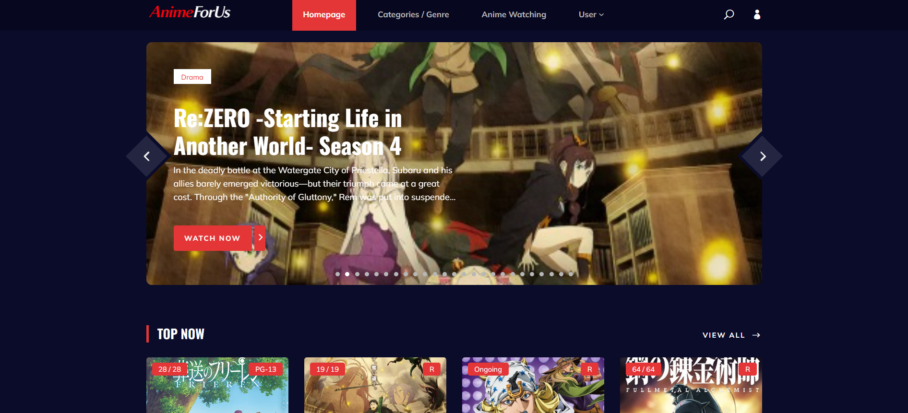
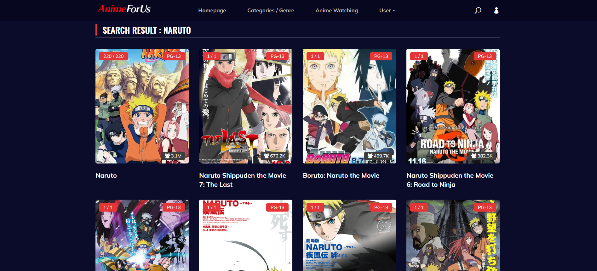
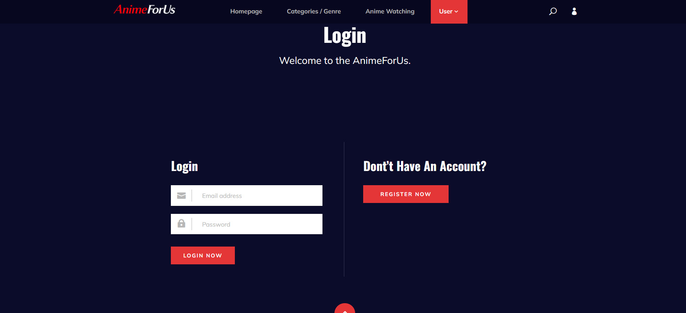

# 🎬 AnimeForUs

AnimeForUs is a dynamic web application that allows users to explore, search, and discover anime content in real-time. The application integrates the Jikan API to provide categorized anime listings such as trending, popular, and genre-based collections.

---

## 🚀 Features

* 🔍 Search anime by name
* 🎬 Anime viewing interface (UI-based player)
* 📈 Trending & Popular anime sections
* 🎭 Browse anime by genres (Action, Comedy, Romance, etc.)
* 🆕 Latest and Upcoming anime
* 👤 User authentication (Login/Register)
* 🧾 Detailed anime information pages
* 💬 Comment system

---

## 🛠️ Tech Stack

* **Backend:** Flask (Python)
* **Frontend:** HTML, CSS, JavaScript
* **Database:** SQLite
* **API:** Jikan API (MyAnimeList Unofficial API)

---

## 📸 Screenshots

### 🏠 Home Page


```

```

### 🔍 Search Feature


```

```

### 📺 Anime Details Page


```

```

### 👤 Authentication Page


```

```

---

## 📂 Project Structure

```
AnimeForUs/
│__ screenshots/      # webiste images
├── static/           # CSS, JS, Images
├── templates/        # HTML templates
├── fetch_data.py     # API handling functions
├── models.py         # Database models
├── routes.py         # Application routes
├── app.py            # Main Flask app
├── requirements.txt  # Dependencies
├── .env              # Environment variables (ignored)
└── README.md
```

---

## ⚙️ Installation & Setup

### 1. Clone the repository

```
git clone https://github.com/YOUR_USERNAME/AnimeForUs.git
cd AnimeForUs
```

---

### 2. Create virtual environment

```
python -m venv venv
venv\Scripts\activate   # For Windows
```

---

### 3. Install dependencies

```
pip install -r requirements.txt
```

---

### 4. Create `.env` file

```
SECRET_KEY=your_secret_key_here
```

---

### 5. Run the application

```
python app.py
```

---

## 🌐 API Used

* Jikan API (https://jikan.moe/)
* Provides anime data without requiring an API key

---

## ⚠️ Limitations

* This application does **not support real anime streaming**
* Uses Jikan API which provides only anime metadata
* Video playback is for **UI demonstration purposes only**

---

## 🚧 Future Scope

* 🎬 Integrate legal streaming sources (if available)
* ⚡ Add caching for improved performance
* 👤 Enhance user profile system
* 🎨 Improve UI/UX design
* 🌍 Deploy application online

---

## 🔐 Security

* Sensitive data like `SECRET_KEY` is stored in `.env`
* `.env` is excluded using `.gitignore`

---

## ⭐ Support

If you like this project, consider giving it a ⭐ on GitHub!
